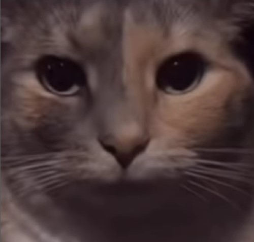

## Hey there! 👋

~~I'm a 2nd year computer science student at Carleton University, with interests in web development and data science.~~
I'm a professional clown.

- 🔭 I’m currently working on: an ObsidianMd plugin to aid Chinese users, and my personal portfolio website.
- 😄 Here is a cat I hired to stare at you:

  
  

<!--
**kiwidisco/kiwidisco** is a ✨ _special_ ✨ repository because its `README.md` (this file) appears on your GitHub profile.

Here are some ideas to get you started:

- 🔭 I’m currently working on ...
- 🌱 I’m currently learning ...
- 👯 I’m looking to collaborate on ...
- 🤔 I’m looking for help with ...
- 💬 Ask me about ...
- 📫 How to reach me: ...
- 😄 Pronouns: ...
- ⚡ Fun fact: ...
-->
